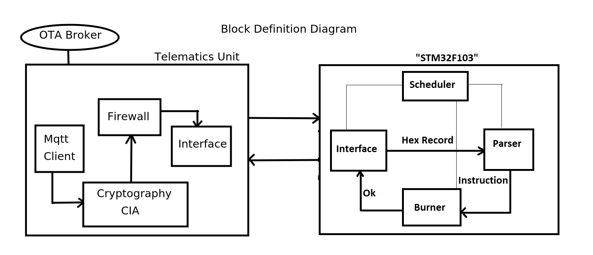

# OTA
```
Over The Air Service Manager (OTA) project that enables remote updates and diagnostics to be
performed on ECUs,. The FOTA process typically involves sending firmware
updates to devices over the air, without requiring physical access to the device. This allows
for more efficient and cost-effective software updates, as well as the ability to quickly
respond to security vulnerabilities and bugs. 
```

## Table of Contents
- [Hardware](#hardware)
- [Block Definition Diagram for the System](#block_definition_diagram_for_the_system)
- [Telematics Unit](#telematics_unit)
  - [Getting Started](#getting_started)
    - [Prerequisites](#Prerequisites)
    - [Installation](#installation)
  - [Usage](#usage)
- [Server](#server)
    - [Getting Started](#getting_started)
- [Bootloader](#bootloader)
  - [Getting Started](#getting_started)
    - [Prerequisites](#Prerequisites)
    - [Installation](#installation)
  - [Usage](#usage)
- [License](#license)


## Hardware
```
Stm32f103
ESP32
```

  
## Block Definition Diagram for the System


## Telematics Unit
### Getting Started
```
- In a Firmware Over The Air (FOTA) project, a ESP32 telematics unit can be used to
  download firmware updates wirelessly from a remote broker
- To download firmware updates from a remote server, the NodeMCU must first connect
  to a Wi-Fi network.
  Once connected, the NodeMCU can use standard communication protocols such as HTTP or
  MQTT to communicate with the remote server and check if any update is available or not,
  if it found it will download the firmware update as a hex file. The NodeMCU can store the
  firmware update in its internal flash memory or external storage such as an SD card or EEPROM.
- Once the firmware update is downloaded, the NodeMCU can initiate the update process on
  the target device using the bootloader.
```
#### Prerequisites:
```
- gcc
- make
```
#### Installation:
1. Clone the repo
```
$ git clone https://github.com/GomaaMohamed/FOTA.git
```
2. Navigate to the telematics folder in the terminal and compile the telematics.c
   to generate the executable.
3. Set the Wifi SSID PASSWORD, Url of check file, and Url of update hex file inside the telematics.c 
## Server
### Getting Started
```
- The server is responsible for hosting the firmware updates and making them available to
  the remote devices. This can be done by storing the firmware updates on a file server,
- Server in our case contains to files
  check_file: to hold the version of the update
  update_file: to hold the update in for of hex
```
## Bootloader
### Getting Started
```
- This is the bootloader that will be used to receive and burn the Hex File sent
  from the telematics unit.
- It is not permissible to receive a Hex record before analyzing and burning the previous one.
- The bootloader comprises the MCAL layer that includes the drivers of the MCU, and an APP layer
  that contains the software components of the application.
- The Interface Module receives the Hex File record by record and sends it to the Parser Module.
- The Parser Module analyzes the Hex record, performs checksum, converts the Hex record from
  ASCII to Hex, sets endianess, and sends the binary instructions to the Burner Module.
- The Burner Module burns and verifies the binary instructions in the internal flash.
```
#### Prerequisites:
```
- arm-none-eabi-gcc
- make
- st-flash
- gdb-multiarch
- openocd
```
#### Installation:
1. Clone the repo
```
$ git clone https://github.com/GomaaMohamed/UART_Bootloader.git
```
2. Modify the path of the project home in the bootloader's makefile.
3. Set the memory boundaries in the linker.ld file.
4. Navigate to the bootloader folder in the terminal and compile the application to generate the executable.
```
$ make all
"This will create a binary executable named app.hex, which is the bootloader executable."
```
5. burn the bootloader
```
$ make flash
```
### Usage
1. To build the Project
```
$ make all
```
2. To clean the Project
```
$ make clean
```
3. To erase the Flash
```
$ make erase
```
4. To burn the Project
```
$ make flash
```
5. To debug the Project
```
$ ./openport
  "This bash script will launch OpenOCD to establish a remote Telnet port on the target"
$ ./startgdb ./app.elf
  "This bash script will initiate a debugging session using gdb-multiarch."
```

## License
```
This library is released under the GNU GPL License ↗. Feel free to use it in your own projects, 
modify it, and distribute it as needed. If you find any issues or have suggestions for
improvement, please open an issue or submit a pull request.
```


