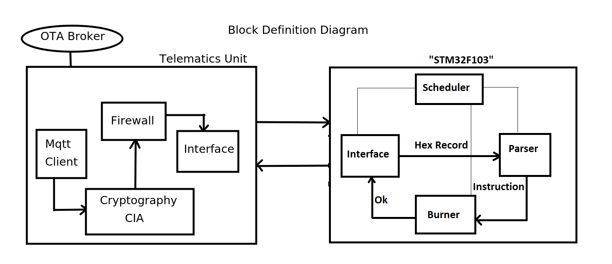

# OTA
```
The Over-the-Air Service Manager is a comprehensive system designed to
facilitate firmware updates and diagnostics for embedded systems,
specifically targeting the automotive industry. Leveraging principles of
cybersecurity, the project ensures confidentiality, integrity, and
authentication through advanced cryptographic techniques. 
```
## Table of Contents

- [Block Definition Diagram for the System](#block_definition_diagram_for_the_system)
- [Key Features](#key-features)
- [Components](#components)
- [Use Cases](#use-cases)
- [Security Considerations](#security-considerations)
- [License](#license)

## Block Definition Diagram for the System



## Key Features

1. **Confidentiality (3DES):**
   - Utilizes Triple Data Encryption Standard (3DES) to ensure the confidentiality of
     firmware updates and diagnostic data during transmission over the air.

2. **Integrity (SHA256):**
   - Implements SHA-256 hashing algorithm to verify the integrity of firmware updates
     and diagnostic messages, safeguarding against unauthorized alterations during transmission.

3. **Authentication (HMAC and Certificate):**
   - Implements HMAC (Hash-based Message Authentication Code) for message authentication,
     ensuring that messages are from legitimate sources.
   - Utilizes digital certificates to authenticate and verify the identity of
     communicating devices, preventing unauthorized access.

## Components

1. **Python Application (MQTT Client):**
   - Acts as an MQTT client responsible for encrypting Unified Diagnostic Services (UDS) frames and
     firmware updates before transmitting them over the MQTT protocol.
   - Decrypts the responses received from connected devices.

2. **MQTT Broker:**
   - Serves as the central communication hub, facilitating secure and reliable communication
     between the Python Application, ESP32, and STM32F103 devices.
   - Supports MQTT protocols for efficient and lightweight messaging.

3. **ESP32 (MQTT Client):**
   - Functions as an MQTT client and plays a vital role in the bidirectional communication process.
   - Decrypts incoming UDS frames and firmware updates before processing them.

4. **STM32F103 (ECU):**
   - Represents the Electronic Control Unit targeted for diagnostics and firmware updates.
   - Interacts with the Python Application and ESP32 to perform diagnostics
     and receive firmware updates securely.

## Use Cases

- **Firmware Updates:**
  - Enables over-the-air firmware updates for the STM32F103 ECU,
    ensuring a secure and streamlined process.
  
- **Diagnostics:**
  - Facilitates diagnostic operations on the STM32F103 ECU, allowing for
    real-time monitoring and troubleshooting.

## Security Considerations

- The use of 3DES ensures confidential transmission of sensitive data.
- SHA256 guarantees the integrity of transmitted messages,
  protecting against tampering.
- HMAC and digital certificates authenticate the origin of messages,
  preventing unauthorized access.

## License

This Project is released under the GNU GPL License ↗. Feel free to 
use it in your own projects, 
modify it, and distribute it as needed. If you find any issues or 
have suggestions for improvement, please open an issue or submit a pull request.


 
